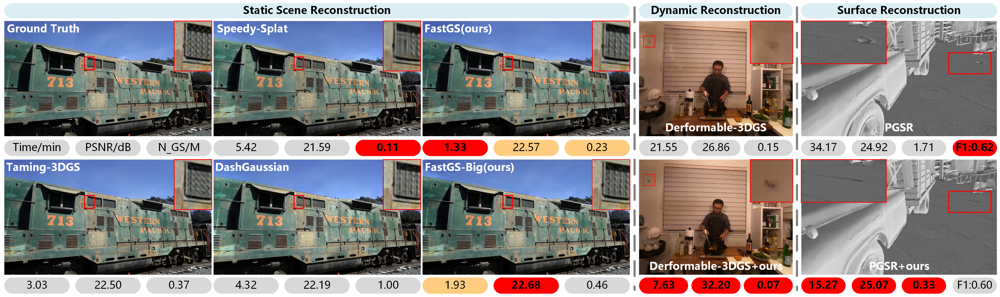

# CarNeRF — 차량 3D 재구성 + AI 진단 플랫폼

> **FastGS (CVPR 2026)** 기반 차량 3D 재구성 · AI 결함 탐지 · 중고차 거래 통합 플랫폼



> *3D Gaussian Splatting 학습 가속 — vanilla 3DGS 대비 최대 **15× 빠름***

---

## 프로젝트 개요

CarNeRF는 차량 영상 한 편으로부터 **고품질 3D 모델 + AI 진단 보고서 + 시세 분석**을 자동 생성하는 중고차 거래 플랫폼입니다. 핵심 3D 재구성 엔진으로 **CVPR 2026** 의 **FastGS** 를 채택하여, A100 한 장에서 차량 1대당 약 **2~3분** 만에 학습이 완료됩니다.

### 핵심 특징

| 기능 | 설명 |
|---|---|
| **FastGS 학습** | CVPR 2026 SOTA — 30K iter ≈ 2~3분 (vanilla 3DGS 60K 대비 15× 가속) |
| **AI 결함 탐지** | YOLOv8 기반 외장 결함 자동 탐지 + 3D 좌표 매핑 |
| **시세 예측** | LightGBM 가격 모델 v2 (실 거래 데이터 기반) |
| **AI 차량 요약** | 전용 RAG 기반 차량 설명 자동 생성 |
| **웹 뷰어** | three.js 기반 인터랙티브 3D 뷰어 (SSR + WebGL) |
| **모바일 앱** | Expo (React Native) 기반 컴패니언 앱 |

### 데모 영상

저장소에 포함된 `CarNerf.mp4` 가 전체 플랫폼 데모입니다 (대용량으로 Git에는 포함되지 않음 — Release 또는 별도 배포 채널 참고).

---

## 빠른 시작

### 1. 환경 셋업

CarNeRF는 두 개의 conda env 를 사용합니다.

```bash
# 메인 env — Backend / Frontend / CV 파이프라인
conda create -n jjh python=3.11 -y
conda activate jjh
pip install -r requirements.txt
bash scripts/setup_env.sh    # COLMAP, rembg 등 의존성 자동 설치

# FastGS 학습 전용 env — py3.7 / torch1.12 / cu11.6 / nvcc 11.8
git clone --recursive https://github.com/fastgs/FastGS.git third_party/FastGS
cd third_party/FastGS
conda env create -f environment.yml
conda activate fastgs
conda install -c nvidia/label/cuda-11.8.0 -c conda-forge cuda-nvcc cuda-cccl cuda-cudart-dev cuda-libraries-dev ninja -y
export CUDA_HOME=$CONDA_PREFIX TORCH_CUDA_ARCH_LIST="8.0"
pip install submodules/diff-gaussian-rasterization_fastgs submodules/simple-knn submodules/fused-ssim
```

자세한 설정은 [docs/SETUP.md](docs/SETUP.md) 참고.

### 2. 영상 한 편으로 전체 파이프라인 실행

```bash
# HQ 모드 — 배경 제거 + FastGS Big 파라미터 (기본 엔진: fastgs)
python scripts/run_pipeline.py \
    --input data/raw/my_car.mp4 \
    --name my_car \
    --hq \
    --engine fastgs

# 결과: backend/app/static/models/my_car/model.splat (웹 뷰어 즉시 사용)
```

엔진 선택:
- `--engine fastgs` (기본, 권장) — CVPR 2026 FastGS, 30K iter 약 2~3분
- `--engine vanilla` — INRIA 3DGS, 60K iter 약 30~40분 (호환성 fallback)

### 3. 학습 직접 실행 (COLMAP 완료 후)

```bash
# FastGS 학습 (별도 env)
python scripts/train_fastgs.py \
    --source_path data/colmap_output/my_car/dense \
    --output_path data/gaussian_output/my_car_v1 \
    --iterations 30000 \
    --grad_abs_thresh 0.0009 \
    --densification_interval 500 \
    --mult 0.7 \
    --antialiasing

# Web export
python scripts/export_model.py \
    --input data/gaussian_output/my_car_v1/point_cloud/iteration_30000/point_cloud.ply \
    --output backend/app/static/models/my_car \
    --format both \
    --max_gaussians 1000000
```

### 4. 웹 서버 실행

```bash
cd backend && python run.py
# → http://localhost:5199
# 차량 상세 페이지에서 3D 뷰어 즉시 확인
```

---

## 파이프라인

```
영상 ──▶ 프레임 추출 ──▶ COLMAP SfM ──▶ rembg(배경제거) ──▶ FastGS 학습 ──▶ Web Export
       (40초)         (10~30분)       (5~10분)          (2~3분)         (즉시)
```

| 단계 | 소요 (A100) | 비고 |
|---|---|---|
| 프레임 추출 | ~40초 | 200 프레임, 흔들림 필터링 |
| COLMAP SfM | 10~30분 | `OPENBLAS_NUM_THREADS=1` 필수 |
| rembg 배경 제거 | 5~10분 | CPU fallback (`u2net`) |
| **FastGS 학습** | **2~3분** | A100, 30K iter |
| 모델 Export | <1초 | volume pruning + .splat 변환 |

> 실측: 평균 1대당 약 30~50분 (영상 길이/품질에 따라 변동)

---

## 아키텍처

```
Project_2026_1/
├── backend/                     FastAPI + Jinja2 SSR + SQLite + JWT
│   └── app/api/                 30+ REST endpoints (vehicles, listings, pipeline, ai, ...)
├── carnerf-mobile/              Expo (React Native) 모바일 앱
├── scripts/                     CV / ML / 3D 파이프라인 스크립트
│   ├── run_pipeline.py             전체 파이프라인 통합 (engine 분기)
│   ├── train_fastgs.py             FastGS 래퍼 (별도 conda env 자동 호출)
│   ├── train_gaussian.py           Vanilla 3DGS 래퍼 (fallback)
│   ├── train_hq.py                 HQ 학습 오케스트레이터
│   ├── train_damage_detector.py    YOLOv8 결함 탐지 학습
│   └── train_price_model.py        LightGBM 가격 모델
├── third_party/
│   ├── FastGS/                     CVPR 2026 — 메인 엔진 (gitignore)
│   ├── gaussian-splatting/         INRIA 3DGS — fallback
│   ├── 2d-gaussian-splatting/      2DGS — 표면 재구성 옵션
│   └── 3dgs-mcmc/                  3DGS-MCMC — 분포 최적화 옵션
└── docs/                        설정 / 데이터 / API 가이드
```

---

## 기술 스택

| 구분 | 기술 |
|---|---|
| 3D 재구성 | **FastGS (CVPR 2026)** · 3D Gaussian Splatting (fallback) |
| Structure-from-Motion | COLMAP |
| AI 결함 탐지 | YOLOv8 |
| 가격 예측 | LightGBM v2 |
| AI 요약 | 전용 RAG + OpenAI API |
| 딥러닝 | PyTorch 2.5 (메인) · PyTorch 1.12 (FastGS 학습) |
| Backend | FastAPI + Jinja2 + SQLite |
| Mobile | Expo (React Native) |
| Frontend | Tailwind CSS + Three.js |
| GPU | NVIDIA A100 80GB |

---

## 참고 문헌

### 핵심 논문

1. **FastGS: Training 3D Gaussian Splatting in 100 Seconds** *(CVPR 2026)*
   - [Project Page](https://fastgs.github.io/) · [Paper](https://arxiv.org/abs/2511.04283) · [GitHub](https://github.com/fastgs/FastGS)

2. **3D Gaussian Splatting for Real-Time Radiance Field Rendering** *(SIGGRAPH 2023)*
   - Kerbl et al., INRIA · [Project Page](https://repo-sam.inria.fr/fungraph/3d-gaussian-splatting/)

3. **COLMAP — Structure-from-Motion and Multi-View Stereo** *(CVPR 2016)*
   - Schoenberger & Frahm · [Docs](https://colmap.github.io/)

### 오픈소스

- [FastGS](https://github.com/fastgs/FastGS) — CVPR 2026
- [Gaussian Splatting](https://github.com/graphdeco-inria/gaussian-splatting) — INRIA
- [COLMAP](https://github.com/colmap/colmap) — ETH Zurich
- [Ultralytics YOLOv8](https://github.com/ultralytics/ultralytics)

---

## 라이선스

본 프로젝트는 연구/교육 목적으로 개발되었습니다. FastGS / 3DGS / COLMAP 등 외부 라이브러리는 각 라이선스를 따릅니다 (대부분 비상업/연구 한정).

## 문의

이슈는 [GitHub Issues](https://github.com/Wlsghdh/CarNeRF/issues) 로 등록 부탁드립니다.
